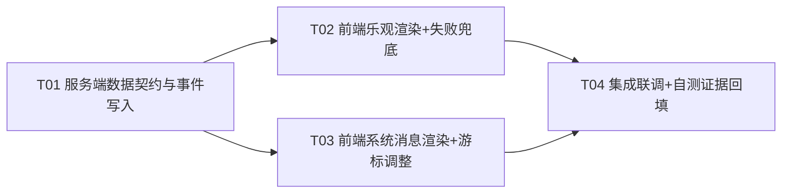

# 会议系统状态持久化 · 系统设计（docs 版）

> 架构师（高见远）产出 · 任务 `T-agent-meeting-state-persist` · 团队 software-agent-meeting-86b4
> 主交付：`dev-work/tasks/T-agent-meeting-state-persist/design.md`（按 TEMPLATE_DESIGN.md 模板）；本文件为完整系统设计 + 任务分解存档。
> 类图：`docs/class-diagram.mermaid`；时序图：`docs/sequence-diagram.mermaid`。

---

## Part A: System Design

### A1. Implementation Approach

**核心难点**：
1. 「先显示后落盘」的时序反转——乐观 UI 与最终落盘消息必须幂等合并（临时 id → 服务端 id 升级替换）。
2. 上下线事件以系统消息持久化——不破坏未读/已读（reads.json）、pull 通道、增量加载游标语义。
3. 不引数据库、不加后台进程、不改传输协议语义的前提下完成以上两点。

**方案骨架**：
- **服务端**：`send_user_message` **保持同步落盘**（Q4=A：实际落盘毫秒级，只改变 UI 不等落盘；不新增线程/进程）。新增 `message_store.append_system_event()`，在 `agent_store.py` 既有 4 处事件写入点原位追加系统消息进 messages.json。
- **前端**：`sendMessage` 改为「先渲染（tempId）→ 发请求 → 成功 upgradeOptimisticMsg 升级 id / 失败标记 failed」。系统消息按 `sender_type=="system"` 渲染灰色居中提示，不参与「N 条新消息」计数。
- **架构模式**：沿用现状的 Router（FastAPI 路由）→ Service（store）→ Storage（JSON+全局锁+原子写）分层；前端保持原生 JS 状态机（无框架），增量加载/去重沿用 T-meeting-incremental 的 insertedIds/pollCursorId 机制。

### A2. File List

| 文件 | 动作 | 说明 |
|---|---|---|
| `agent-meeting/server/app/services/message_store.py` | 改 | 新增 `append_system_event`；`send_user_message`/`get_history` 语义不变 |
| `agent-meeting/server/app/services/agent_store.py` | 改 | 4 处事件点原位调用 `append_system_event`（函数体内局部导入防循环） |
| `agent-meeting/server/app/static/app.js` | 改 | sendMessage 乐观化 + pendingMap/tempToServerId + 失败重试/删除 + 系统消息渲染 + pollNew 排除系统消息计数 + 移除 loadAgents diff 临时提示 |
| `agent-meeting/server/app/static/styles.css` | 改 | 新增 `.msg-failed` 失败标记/按钮样式（`.sys-notice` 已有，可复用） |
| `agent-meeting/server/app/static/index.html` | 改 | `?v=` 版本号 bump（防缓存偏斜） |
| `dev-work/tasks/T-agent-meeting-state-persist/design.md` | 改 | 本方案 |
| `docs/system_design.md` / `docs/class-diagram.mermaid` / `docs/sequence-diagram.mermaid` | 新增 | 架构存档 |

**不改**：`routers/messages.py`、`routers/agents.py`、`schemas.py`、`storage.py`、`config.py`、`main.py`、`skill/loop.py`、`会议系统/agent_hub/`。

### A3. Data Structures and Interfaces

见 `docs/class-diagram.mermaid`（classDiagram）。核心：

- `MessageStore.append_system_event(event, agent_name)`：新增系统消息写入。
- `AgentStore` 4 事件点 → 调 `MessageStore.append_system_event`。
- `FrontendState`：insertedIds / pollCursorId / clientNewestId / pendingMap / tempToServerId。
- `Message` 数据模型新增 `sender_type:"system"`、`message_type:"presence_event"`、`event`。

### A4. Program Call Flow

见 `docs/sequence-diagram.mermaid`（sequenceDiagram），覆盖：
1. 发送消息先显示后落盘（乐观渲染 → 同步落盘 → id 升级 → 幂等）。
2. 发送失败兜底（保留显示 + 重试复用 client_msg_id + 删除本地）。
3. 上下线事件持久化入消息流（init/end/lost/reactivated → 系统消息 → 前端灰色提示）。
4. 刷新/重启后可见（history 返回含系统消息）。

### A5. Anything UNCLEAR（假设与待确认）

- **假设**：系统消息 content 文案由服务端生成，前端只渲染（保证刷新一致）。
- **假设**：`registered`（首次注册）不写消息流；`deleted`（清扫删除）不写消息流（均不在 AC-4.3 范围）。
- **假设**：删除仅作用于本地乐观（未落盘）消息；已落盘消息不提供服务端删除（PRD 未要求）。
- **待确认**：lost 文案「已离线（失联超时）」与 end 文案「下线了」的措辞——已给出默认，测试/老板可微调文案（不影响契约）。

---

## Part B: Task Decomposition

### B1. Required Packages

无新增第三方包（沿用 FastAPI + uvicorn + pydantic；前端原生 JS 无框架）。测试沿用 `curl` / 浏览器 / 既有 e2e 脚本。

### B2. Task List（≤5 任务，按依赖排序）

| Task | 名称 | 源文件 | 依赖 | 优先级 |
|---|---|---|---|---|
| T01 | 服务端数据契约与事件写入（append_system_event + agent_store 4 事件点 + 隔离自测目录/端口） | `message_store.py`、`agent_store.py`、`test_data_state_persist/`、design.md 自测节 | 无 | P0 |
| T02 | 前端乐观渲染 + 失败兜底（sendMessage 重构 + pendingMap/tempToServerId + 重试/删除 + CSS + 版本号） | `app.js`、`styles.css`、`index.html` | T01 | P0 |
| T03 | 前端系统消息渲染 + 游标/计数调整（buildMessageNodes system 分支 + pollNew 排除 + 移除 diff 临时提示） | `app.js`、`styles.css` | T01 | P0 |
| T04 | 集成联调 + 自测证据回填（隔离实例端到端跑 AC-1.1~4.3，回填 git diff/stdout/截图） | design.md、test.md 输入 | T02、T03 | P0 |

### B3. Shared Knowledge

- 所有 JSON 写入必须走 `update_json_atomic` 原地修改（D-1 铁律），不可只返回新对象。
- 系统消息 `sender_type` 必须为 `"system"`（≠`"user"`），否则会进 pull 未读 / 未读统计。
- 乐观渲染只推进 `clientNewestId`，绝不推进 `pollCursorId`（BUG-C）；失败不更新 `clientNewestId`（BUG-D）。
- 隔离自测：`DATA_DIR` 指向独立目录（如 `server/test_data_state_persist`）+ 隔离端口（如 8025）+ `SWEEP_INTERVAL=0`；测试消息带 `[TEST-DATA]` 前缀；严禁写生产 `server/data`。
- 事件文案由服务端生成；事件消息不入 `reads.json`、不触发「N 条新消息」banner。

### B4. Task Dependency Graph

