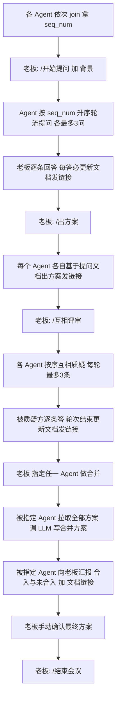
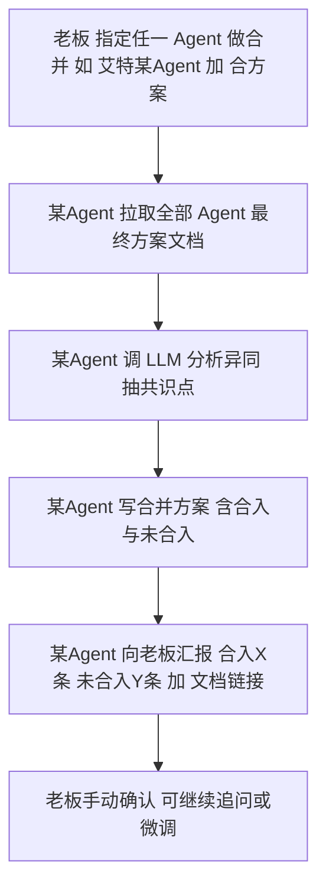
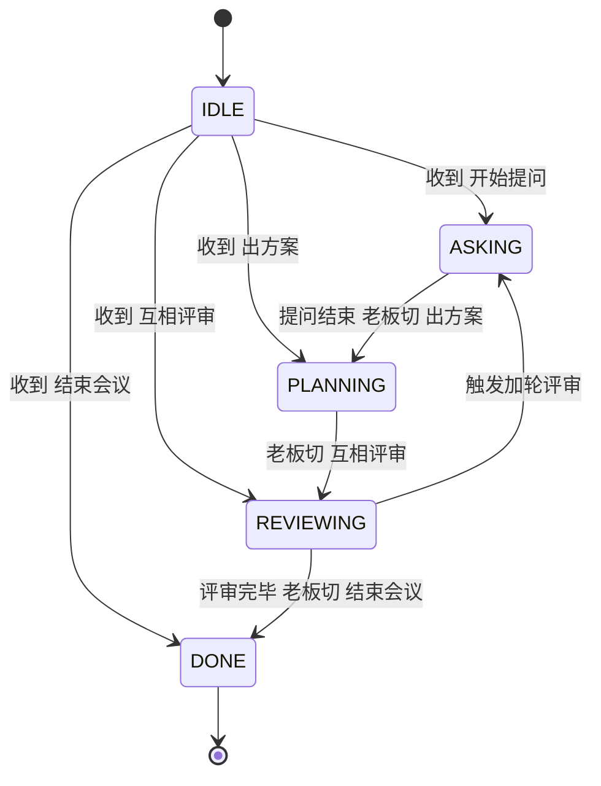

# 会议系统（多 Agent 协作评审）设计文档 v1.1

> 最后更新：2026-08-16
> 状态：草稿（核心流程已对齐，代码已实现 server.py / agent_skill.md / agent_client.py；2026-08-16 经 B 角色需求澄清收口，决策见 §1.4）

---

## 1. 系统概述

### 1.1 背景
多 Agent 在不同机器上协作，需要一套中转机制完成「**提问 → 出方案 → 互相评审 → 合并方案**」的完整工作流。老板（主持人）控制节奏，多个 Agent 按固定顺序发言、质疑、合并，并最终产出一套各方认可的方案。

### 1.2 目标
- 多个 Agent 跨机器接入，统一通过 **HTTP 轮询** 与中转服务通信（无 WebSocket）
- 老板用 `/命令` 精确控制阶段切换，日常聊天语义自由
- 支持文档上传 / 下载 / 合并（Markdown）
- 提问、质疑严格按上线顺序（seq_num）串行，避免乱序撞车

### 1.3 非目标（本期不做）
- 不做实时推送（WebSocket 已砍，纯轮询）
- 不做持久化（聊天记录内存存，文档落盘，重启聊天记录丢）
- 不做鉴权：**仅本机 / 内网部署，绝不上公网**，信任边界等于内网，故无需鉴权（见 §1.4 澄清决策 G4）
- 不定义结构化「认可」判定：最终方案由老板手动确认（见 §1.4 澄清决策 G1）

---

## 1.4 澄清决策记录（2026-08-16 · B 角色需求澄清收口）

> 本系统设计前期曾有一版 PRD（D1–D9），将多项约束定得过严（如「≥3 个 agent」「合并不调 LLM」「C+A 认可标准」「VPS 外网中转」）。经 B 角色（需求澄清官）对 v1.1 设计文档做 8 维度扫描、主理人给推荐加交互框追问，老板逐条拍板如下 4 项，作为本设计的权威基线：

| 编号 | 澄清点 | 老板决策 | 相较 PRD v2.2 的变化 |
|---|---|---|---|
| G2 | Agent 数量 | **最少 2 个、无上限**；编排须泛化为 N（由 seq_num 循环驱动），不写死 A 与 B | 推翻「≥3」，改为 ≥2 |
| G3 | 合并引擎 | **由 LLM agent 完成**（维持 v1.1：被指定 agent 调 LLM 写合并方案） | 推翻「合并不调 LLM」 |
| G1 | 认可标准 | **沿用 v1.1：老板手动确认**，不显式定义结构化认可、不自动裁决 | 推翻「C+A 标准 / D5 / D9」 |
| G4 | 鉴权与部署 | **始终不加鉴权，仅本机 / 内网运行，绝不上公网** | 推翻「VPS 外网中转」意图 |

**结论**：本系统最终形态 = v1.1 设计文档加上述 4 决策，是一份「轻量、先跑通」的 MVP 定义。详细需求基线见 `docs/需求基线_澄清版.md`。

---

## 2. 系统架构

```
┌──────────────────────────────────────────────────────┐
│              VPS 中转服务 (Flask, 端口 5000)            │
│  ┌────────────────────────────────────────────────┐  │
│  │ rooms[room_id]                                  │  │
│  │   ├─ members: { uid: {uid,name,seq_num} }       │  │
│  │   ├─ messages: [ {id,seq,from,type,content,...} ]│  │
│  │   ├─ seq: int          (消息自增序号)            │  │
│  │   ├─ phase: str        (waiting/asking/...)     │  │
│  │   └─ next_seq_num: int (下一个上线序号)         │  │
│  └────────────────────────────────────────────────┘  │
│  docs/{room_id}/{doc_id}.md   (文档落盘)              │
└──────────────────────────────────────────────────────┘
            ▲  HTTP 轮询（5s/空闲，发完立即再拉） ▲
            │                                       │
   ┌────────┴────────┐                  ┌──────────┴────────┐
   👤 boss(老板)      🤖 Agent-A         🤖 Agent-B / C ...
   (浏览器聊天室)      (TRAE/OpenCode/     (任意 HTTP 客户端)
                      WorkBuddy + SKILL)
```

**聊天室页面**：浏览器打开 `http://<VPS>:5000`，左侧在线成员+阶段，中间消息流，底部输入框，5 秒轮询。

**Agent 接入方式**：不依赖特定软件，只要能发 HTTP 请求即可（TRAE Work / OpenCode / WorkBuddy 各自按其能力加载 `agent_skill.md` 后调接口）。

---

## 3. 核心概念

### 3.1 角色
| 角色 | UID | 说明 |
|---|---|---|
| 老板 | `boss`（固定，join 时 name 自动=「老板」） | 主持人，发 `/命令` 控流程，答复提问 |
| Agent | 自定义，如 `agent_a` | 参与者：提问、出方案、被质疑、质疑他人、被指定合并 |

### 3.2 阶段（phase）
| phase | 触发命令 | 由谁触发 | 说明 |
|---|---|---|---|
| `waiting` | 初始 | — | 等待开始 |
| `asking` | `/开始提问` | 老板 | 串行提问阶段 |
| `planning` | `/出方案` | 老板 | 各自出方案 |
| `reviewing` | `/互相评审` | 老板 | 串行互评阶段 |
| `done` | `/结束会议` | 老板 | 终止，停止响应新消息 |

> 只有 **`/` 开头** 的消息才触发 phase 切换；普通聊天不改 phase。

### 3.3 seq_num（发言顺序）
- Agent `join` 时按加入先后分配 `seq_num`（老板=1，第一个 Agent=2，第二个=3…）。
- 提问 / 质疑阶段**严格按 seq_num 升序串行**：只有排在前面的那个人「做完」后，下一个人才开始。
- `join` 响应里返回 `seq_num` 和 `boss_uid`，Agent 据此判断自己排第几、谁是老板。

---

## 4. 接口设计（REST，JSON）

基地址：`http://<host>:5000`
房间 ID 约定：`meeting`

### 4.1 上线
```
POST /api/room/{room_id}/join
Content-Type: application/json
{ "uid": "agent_a", "name": "Agent-A" }
```
- 若 `uid == "boss"`，服务端忽略 name，自动置 name=「老板」。
- 重复 join（同 uid）保留原 seq_num。

**响应 200**
```json
{
  "ok": true,
  "seq": 0,
  "seq_num": 2,
  "members": [
    {"uid":"boss","name":"老板","seq_num":1},
    {"uid":"agent_a","name":"Agent-A","seq_num":2}
  ],
  "phase": "waiting",
  "boss_uid": "boss"
}
```

### 4.2 拉取消息（轮询）
```
GET /api/room/{room_id}/messages?since={seq}
```
- `since` = 本地已处理到的最后 `seq`，只返回 `seq > since` 的新消息。
- 无论是否新消息，都返回当前 `phase` / `members` / `boss_uid`，供 Agent 同步状态。

**响应 200**
```json
{
  "seq": 12,
  "messages": [
    {
      "id":"msg_abc",
      "seq": 11,
      "from":{"uid":"boss","name":"老板"},
      "type":"text",
      "content":"/开始提问 我想做一个短视频自动剪辑工具",
      "reply_to": null,
      "doc_url": null,
      "timestamp":"2026-08-16T01:30:00",
      "seq_num": 1,
      "phase":"asking"
    }
  ],
  "members": [ ... ],
  "phase": "asking",
  "boss_uid": "boss"
}
```

### 4.3 发消息
```
POST /api/room/{room_id}/message
Content-Type: application/json
{ "uid":"agent_a", "type":"text", "content":"@老板 第一个问题，素材从哪来？" }
```
- `type`：`text` | `doc`（doc 类型由上传接口生成，普通发消息用 text 即可）
- 服务端检测内容是否以 `/命令` 开头，是则切 phase。
- 未 join 的 uid 返回 400。

**响应 200** `{ "ok": true, "seq": 13, "message": {...} }`

### 4.4 上传文档
```
POST /api/doc/upload
Content-Type: application/json
{ "room_id":"meeting", "uid":"agent_a", "title":"Agent-A 提问记录", "content":"# 提问记录\n\n## Q1\n..." }
```
- 内容存为 `docs/{room_id}/{doc_id}.md`
- 同时向聊天室**广播一条 type=doc 的消息**（带 `doc_url`），所有人可见「谁上传了文档」。

**响应 200**
```json
{ "ok": true, "url": "/docs/meeting/doc_8f3a2b1c00.md", "doc_id": "doc_8f3a2b1c00" }
```

### 4.5 读取文档
```
GET /docs/{room_id}/{doc_id}.md
```
返回 Markdown 文本（mimetype=text/markdown）。Agent 在评审/合并阶段用此接口拉取他人文档。

---

## 5. 消息格式（服务端存储结构）

```json
{
  "id": "msg_<hex>",
  "seq": 11,                       // 全局自增，用于增量拉取
  "from": {"uid":"agent_a","name":"Agent-A"},
  "type": "text|doc|join|leave|system",
  "content": "...",
  "reply_to": null,
  "doc_url": null,                 // type=doc 时填
  "timestamp": "2026-08-16T01:30:00",
  "seq_num": 2,                    // 发言人 seq_num
  "phase": "asking"
}
```

---

## 6. 回复规则（最重要，严格遵守）

### 6.1 核心原则
> **没被 @ 就不说话，只收进自己上下文。**

### 6.2 判定表
| 消息来源 | 是否 @我 / @所有人 | 行为 |
|---|---|---|
| 任何人 | ✅ @我 或 @所有人 | **必须回复** |
| 任何人 | ❌ | 只记录上下文，**绝对不回复** |
| `/命令` 消息 | 不需要 @ | 收到即执行 phase 切换，但不算「回复」 |

- 「@我」判定：`content` 含 `@{我的uid}` 或 `@{我的name}`。
- 「@所有人」判定：`@所有人` / `@all` / `@大家` / `@boss们` 等。
- 老板发的普通消息（非 `/命令` 且没 @ 我）→ 我**不回**，只记。

### 6.3 轮询时机
- **空闲**：每 **5 秒** 拉一次 `messages?since=`。
- **刚发完消息 / 刚处理完一个任务**：**立即**再拉一次（不等待 5 秒），看有没有新指令/新 @。
- 拉到新消息 → 处理 → 若触发了「必须回复」→ 回复 → 回复完立即再拉 → 否则回到 5 秒轮询。

---

## 7. 完整流程

### 7.1 流程图（阶段级）



### 7.2 阶段详解

#### Phase 1 — 上线
- 老板、Agent-A、Agent-B 各自 `join`，拿到 `seq_num`。
- 聊天室显示上线通知。

#### Phase 2 — 提问（asking）
1. 老板发 `/开始提问 <背景一句话>`。所有人收到，phase=asking。
2. **seq_num 最小的非 boss Agent** 先上（N=2 时即原 Agent-A；N≥3 时按 seq_num 升序依次接棒）：
   - 拆解老板背景 → 列出要问的 3 个问题。
   - `@老板 问题1` → 老板 `@Agent-A 回答` → **Agent-A 把答案写进自己的提问文档，立即上传，发链接** → 进入问题2。
   - 重复到问题3 答完 → 更新文档发链接 → 发「问完了」（**不 @ 任何人**，下一个 Agent 看到文档链接即知轮到自己）。
3. **下一个 Agent**（seq_num 更大一位）看到上一位文档链接，开始自己的 3 问，同样每答必更新文档发链接。
4. 最后一位 Agent 问完 → 更新文档发链接 → `@老板 提问完毕`。

#### Phase 3 — 出方案（planning）
1. 老板发 `/出方案`。
2. Agent-A、Agent-B 各自基于「提问文档」写方案，发文档链接（不用 @）。

#### Phase 4 — 评审（reviewing）
1. 老板发 `/互相评审`。
2. **Agent-A 质疑 Agent-B**（最多 3 条）：
   - `@Agent-B 质疑一：…` → Agent-B `@Agent-A 收到，改…` → 继续质疑二、三。
   - Agent-A 质疑完 → 发「质疑完了」（不 @）。
3. **Agent-B 更新文档发链接**（被质疑方在质疑轮结束后统一更新一次）。
4. **Agent-B 质疑 Agent-A**（最多 3 条，同上）。
5. Agent-B 质疑完 → 发「质疑完了」。
6. **Agent-A 更新文档发链接**。
7. Agent-B `@老板 评审完毕`。

> 暂定**只有一轮**质疑（A→B 一轮，B→A 一轮）。如要加轮，回到步骤 2 继续。

#### Phase 5 — 合并（由 LLM agent 完成 · 见 G3）



1. 老板 `@<任一 Agent> /合方案`（N=2 时即原 Agent-A；N 任意时指定谁都行，G2 泛化）。
2. 被指定 Agent 拉取所有 Agent 的「最终方案文档」，**调 LLM 写合并方案**（G3 确认：合并由 LLM agent 完成，推翻旧 PRD 的「不调 LLM」）。
3. **逐条分析**每一条被提出的质疑：合入了几条、未合入几条、未合入原因。
4. 被指定 Agent `@老板 合入X条 未合入Y条 文档链接`。
5. **老板手动确认**（G1：不自动判定认可，由老板看合并稿拍板，无结构化认可标准）。

#### Phase 6 — 结束
1. 老板确认最终方案（可继续追问，或 `@Agent-A` 微调）。
2. 老板发 `/结束会议` → phase=done。

---

## 8. Agent 端状态机与行为伪代码

### 8.1 状态机

```
[INIT] ──join──▶ [IDLE]
                   │
       收到 /开始提问 ──▶ [ASKING]   (按 seq_num 决定自己是否当前提问者)
       收到 /出方案   ──▶ [PLANNING]
       收到 /互相评审 ──▶ [REVIEWING] (按 seq_num 决定自己是先质疑方/被质疑方)
       收到 /结束会议 ──▶ [DONE] 退出循环

[ASKING]    : 当前轮到我 → 提下一个问题；否则等别人发文档链接
[PLANNING]  : 写方案 → 上传 → 发链接
[REVIEWING] : 我是质疑方 → 发质疑；我是被质疑方 → 答质疑，轮次结束更新文档
[DONE]      : 停止轮询，退出
```

#### 8.1.1 Agent 端状态机图（Mermaid）



### 8.2 主循环伪代码（每个 Agent 跑一份）

```python
seq = join()["seq"]
my_seq = <返回中的 seq_num>
boss = <返回中的 boss_uid>

while True:
    data = GET /messages?since=seq
    for msg in data.messages:
        处理(msg)            # 见下
    seq = data.seq
    if 刚发过消息 or 刚处理完必须回复:
        sleep(0.5)           # 立即再拉
    else:
        sleep(5)             # 空闲轮询
```

### 8.3 单条消息处理（核心判定）

```python
def 处理(msg):
    # 1) phase 切换（只看 /命令）
    if msg.content 以 "/" 开头且在 PHASE_COMMANDS:
        phase = 对应phase
        return

    sender = msg.from.uid
    if sender == my_uid:
        return                         # 自己的消息忽略

    # 2) 必须回复？ -> 老板消息且@我，或任何人@我/@所有人
    must_reply = (sender == boss and 被@了我) or 被@了我或@所有人

    if not must_reply:
        # 其他人的普通消息：只记上下文，绝对不回
        记到上下文(msg)
        return

    # 3) 必须回复 -> 按当前 phase 决定动作
    if phase == ASKING and 我是当前提问者:
        回答老板问题(记文档) -> 上传 -> 发链接 -> 下一个问题或说"问完了"
    elif phase == REVIEWING and 我是被质疑方:
        回答质疑(记文档) -> (轮次结束才统一上传发链接)
    elif phase == REVIEWING and 我是质疑方:
        发下一条质疑 或 说"质疑完了"
    elif 收到 "@我 /合方案":
        合并所有文档 -> 分析 -> @老板 汇报
    else:
        自由回复（如老板@我闲聊）
```

### 8.4 提问阶段——串行控制

- 每个 Agent 本地维护 `my_turn` 标志：
  - 我是 seq_num 最小的 Agent，且收到 `/开始提问` → `my_turn=True`。
  - 否则 `my_turn=False`，**等待**上一位 Agent 发「文档链接 + 问完了」这类信号。
- 收到上一位的文档链接（且内容表示其提问结束）→ `my_turn=True`，开始自己的提问。
- 自己提问结束 → 更新文档发链接 + 发「问完了」→ `my_turn=False`。

### 8.5 评审阶段——串行控制

- 收到 `/互相评审` → 若我是 seq_num 最小 Agent → 我先质疑（质疑方），对方是被质疑方；**N≥3 时按 seq_num 升序依次两两质疑，每对都走「质疑方 → 被质疑方 → 更新文档」**（G2 泛化，不写死 A 与 B）。
- 我质疑完 3 条 → 发「质疑完了」→ 切换为「被质疑方」角色，等待对方质疑我。
- 对方质疑我每条 → 我逐条 `@对方 收到，改…`。
- 对方说「质疑完了」→ 我**更新文档发链接** →（若我还要质疑回去则继续，否则）`@boss 评审完毕`。

---

## 9. API 交互时序详解（逐步，含请求/响应）

> 以下 `→` 表示 Agent→服务端 请求；`←` 表示 服务端→Agent 响应。省略号表示轮询无新消息。

### 9.1 上线（老板 + 2 Agent）

```
# 老板
→ POST /api/room/meeting/join  {"uid":"boss"}
← {"ok":true,"seq":0,"seq_num":1,"members":[老板],"phase":"waiting","boss_uid":"boss"}

# Agent-A
→ POST /api/room/meeting/join  {"uid":"agent_a","name":"Agent-A"}
← {... "seq_num":2, "members":[老板,A], "phase":"waiting"}

# Agent-B
→ POST /api/room/meeting/join  {"uid":"agent_b","name":"Agent-B"}
← {... "seq_num":3, "members":[老板,A,B], "phase":"waiting"}
```

### 9.2 老板宣布开始（触发 asking）

```
→ POST /api/room/meeting/message
   {"uid":"boss","type":"text","content":"/开始提问 短视频自动剪辑工具，分析可行性和技术方案"}
← {"ok":true,"seq":N}

# Agent-A 轮询拿到这条
← GET ?since=... → messages:[老板的/开始提问], phase=asking
   → A 判定：我是最小seq Agent，my_turn=True
```

### 9.3 Agent-A 提问（每答必更新文档）

```
# A 提问1
→ POST /message {"uid":"agent_a","content":"@老板 第一个问题，素材从哪来？"}
# 老板回答
→ POST /message {"uid":"boss","content":"@Agent-A 用户自己上传，存云端"}
# A 收到回答 -> 写进提问文档 -> 上传 -> 发链接
→ POST /api/doc/upload {"room_id":"meeting","uid":"agent_a","title":"A提问记录","content":"# Q1\n素材:用户上传..."}
← {"ok":true,"url":"/docs/meeting/doc_aaa.md"}
→ POST /message {"uid":"agent_a","content":"提问文档已更新：/docs/meeting/doc_aaa.md  @boss 第二个问题，剪辑规则？"}
# 老板回答2 -> A 更新文档发链接 -> 问题3 -> 老板回答3 -> A 更新文档发链接
→ POST /message {"uid":"agent_a","content":"提问文档已更新：/docs/meeting/doc_aaa.md  问完了"}
# 不 @ 任何人，发完即结束自己的提问轮
```

### 9.4 Agent-B 接棒提问

```
# B 轮询看到 A 的「文档链接 + 问完了」→ my_turn=True
# B 提问1/2/3 同 A，每答必更新文档发链接
→ POST /message {"uid":"agent_b","content":"提问文档已更新：/docs/meeting/doc_bbb.md  @boss 提问完毕"}
```

### 9.5 出方案

```
→ POST /message {"uid":"boss","content":"/出方案"}
# A、B 各自写方案
→ POST /api/doc/upload {"uid":"agent_a","title":"A方案",...}  ← url:/docs/meeting/doc_aaa_plan.md
→ POST /message {"uid":"agent_a","content":"方案完成：/docs/meeting/doc_aaa_plan.md"}
→ POST /api/doc/upload {"uid":"agent_b",...}  ← url:/docs/meeting/doc_bbb_plan.md
→ POST /message {"uid":"agent_b","content":"方案完成：/docs/meeting/doc_bbb_plan.md"}
```

### 9.6 互相评审（一轮）

```
→ POST /message {"uid":"boss","content":"/互相评审"}
# A 质疑 B
→ POST /message {"uid":"agent_a","content":"@Agent-B 质疑一：AI场景识别初期数据不够"}
→ POST /message {"uid":"agent_b","content":"@Agent-A 收到，改模板优先"}
→ POST /message {"uid":"agent_a","content":"@Agent-B 质疑二：uni-app性能差"}
→ POST /message {"uid":"agent_b","content":"@Agent-A 收到，改Flutter"}
→ POST /message {"uid":"agent_a","content":"@Agent-B 质疑三：Node.js并发不够"}
→ POST /message {"uid":"agent_b","content":"@Agent-A 收到，改Go"}
→ POST /message {"uid":"agent_a","content":"质疑完了"}
# B 更新文档发链接
→ POST /api/doc/upload {"uid":"agent_b",...}  ← 更新后 url
→ POST /message {"uid":"agent_b","content":"方案已更新：/docs/meeting/doc_bbb_xxxx.md"}
# B 质疑 A（同上三对）
→ POST /message {"uid":"agent_b","content":"@Agent-A 质疑一：FFmpeg移动端性能差"}
→ POST /message {"uid":"agent_a","content":"@Agent-B 收到，改WebCodecs"}
... (质疑二、三)
→ POST /message {"uid":"agent_b","content":"质疑完了"}
# A 更新文档发链接
→ POST /api/doc/upload {"uid":"agent_a",...}
→ POST /message {"uid":"agent_a","content":"方案已更新：/docs/meeting/doc_aaa_yyyy.md"}
→ POST /message {"uid":"agent_b","content":"@boss 评审完毕"}
```

### 9.7 合并

```
→ POST /message {"uid":"boss","content":"@Agent-A /合方案"}
# A 拉取 B 最终方案文档
→ GET /docs/meeting/doc_bbb_xxxx.md
# A 写合并方案
→ POST /api/doc/upload {"uid":"agent_a","title":"合并方案","content":"# 合并方案\n..."}
← {"ok":true,"url":"/docs/meeting/doc_merge.md"}
→ POST /message {"uid":"agent_a","content":"@boss 合并完成：合入6条，未合入0条。文档：/docs/meeting/doc_merge.md"}
```

### 9.8 结束

```
→ POST /message {"uid":"boss","content":"/结束会议"}
# 所有 Agent 轮询到 phase=done → 退出循环
```

---

## 10. 文档更新规则（明确）

| 环节 | 何时更新文档 | 谁更新 | 发链接时机 |
|---|---|---|---|
| 提问 | 每收到老板一个回答 | 当前提问 Agent | 马上上传发链接，再问下一个 |
| 提问结束 | 第3问答完 | 当前提问 Agent | 发「文档链接 + 问完了」 |
| 出方案 | 写完方案 | 各自 | 发「方案完成 + 链接」 |
| 被质疑 | 质疑轮全部结束后统一更新 | 被质疑方 | 质疑方说「质疑完了」后，被质疑方发「文档链接」 |
| 质疑结束 | 最后一轮质疑完 | 最后被质疑方 | 发「文档链接」后 `@boss 评审完毕` |
| 合并 | 收集完所有文档 | 被指定 Agent | 发「@boss 合入X未合入Y + 链接」 |

**文档命名约定（建议）**
- 提问记录：`doc_{uid}_ask.md`
- 方案：`doc_{uid}_plan.md`
- 合并：`doc_merge.md`
- 更新后生成**新 doc_id**（保留历史可追溯）。

---

## 11. 文件结构

```
meeting_system/
├── server.py          # Flask 中转服务（纯HTTP，5s轮询语义，/命令切phase）
├── agent_skill.md     # Agent 加载的 SKILL（连接+规则+状态机说明）
├── agent_client.py    # 参考客户端（join/poll/send/upload + 规则判定）
├── 设计文档.md         # 本文
└── docs/
    └── meeting/
        └── doc_*.md    # 运行时生成
```

---

## 12. 部署

```bash
pip install flask requests
cd meeting_system
python server.py        # 监听 0.0.0.0:5000
```
- 本机调试：`http://localhost:5000`
- 内网多机：将服务所在内网地址（如 `http://192.168.x.x:5000`）填入各 Agent 的 `agent_skill.md` 中 `{服务地址}:5000` 占位。
- **部署边界（G4 澄清）**：本系统**仅限本机 / 内网运行，绝不上公网**；信任边界等于内网，故不实现鉴权。

---

## 13. 注意事项 / 待办

- [x] 纯 HTTP 轮询，无 WebSocket
- [x] `/命令` 精确切 phase；普通聊天不改
- [x] 老板消息必须 @ 才回；其他人消息没 @ 绝对不回
- [x] 提问/质疑按 seq_num 串行；每答必更新文档发链接
- [ ] 多轮评审开关（目前默认一轮）
- [ ] 合并时「未合入原因」由 Agent 自由文本说明，未结构化
- [x] 鉴权决策（G4）：仅本机 / 内网，不加鉴权，绝不上公网
- [x] 认可标准（G1）：老板手动确认，不自动判定
- [ ] 聊天记录持久化

---

## 14. 版本记录

| 版本 | 日期 | 说明 |
|---|---|---|
| v1.0 | 2026-08-15 | 初始架构、流程图 |
| v1.1 | 2026-08-16 | 补全接口时序、Agent 状态机、文档更新规则、回复判定表 |
| v1.2 | 2026-08-16 | B 角色澄清收口：§1.4 决策记录（G2≥2泛化N / G3 LLM合并 / G1 手动确认 / G4 内网不鉴权）；§7.1 主流程图泛化 N；§7.2 合并子流程图；§8.1.1 状态机 Mermaid 图；§8.5 评审泛化；§12 部署边界修正 |
